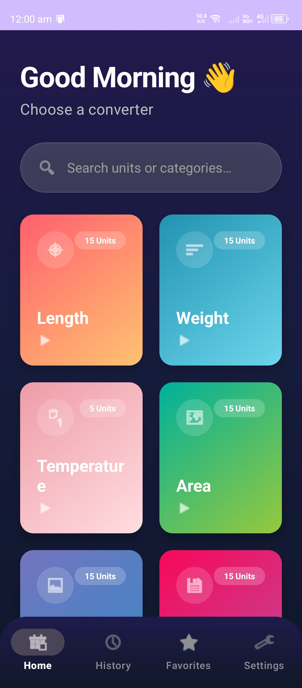
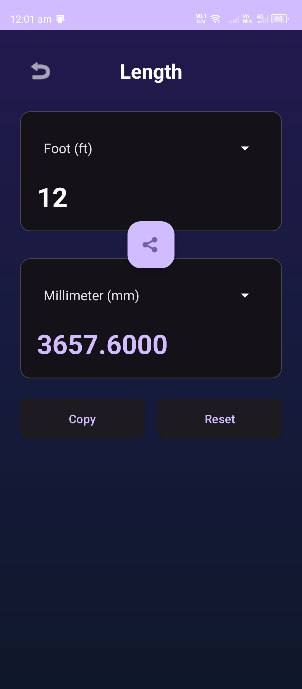
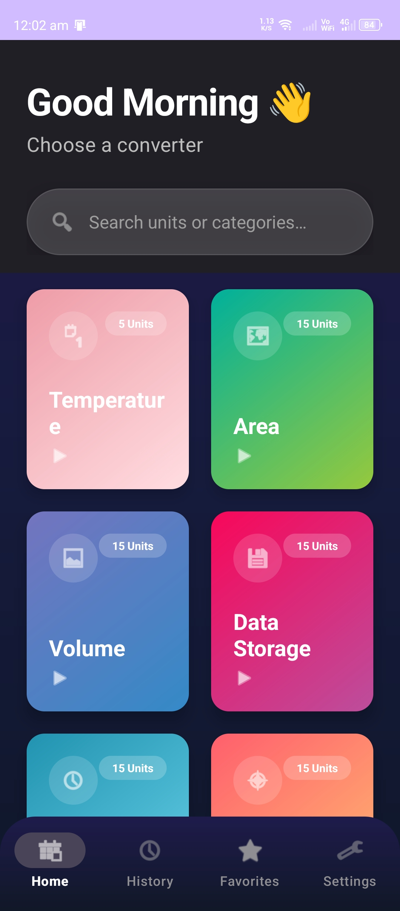
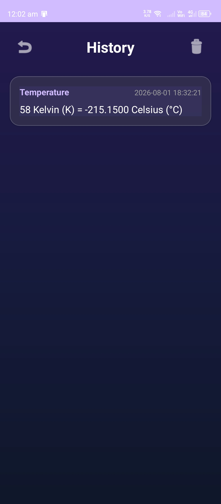
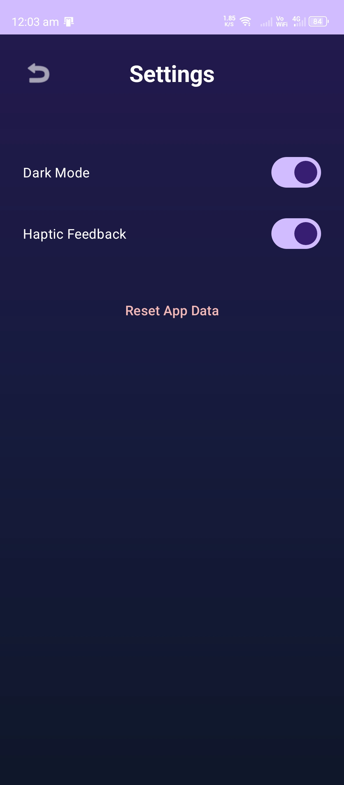

# 📏 Unit Converter - Premium Android Application

<div align="center">


A modern, responsive and feature-rich **Unit Converter** application developed using **Java**, **XML**, and **Material Design 3**. The app provides fast, accurate, and offline unit conversions with a clean and premium user experience.

</div>

---

# 📱 Preview

> Add screenshots of your application below.

| Home | Converter |
|------|-----------|
|  |  |

---

# ✨ Features

- 📏 Length Converter
- ⚖️ Weight Converter
- 🌡️ Temperature Converter
- ⏱️ Time Converter
- 🚀 Speed Converter
- 💾 Data Storage Converter
- 📐 Area Converter
- 🧪 Volume Converter
- ⚡ Energy Converter
- 🔋 Power Converter
- 🔍 Search Units
- 🔄 Swap Units
- 📋 Copy Result
- ❤️ Favorite Converters
- 📜 Conversion History
- 🌙 Dark Theme
- 📱 Responsive Design
- ⚡ Fast Offline Conversion
- 🎨 Material Design 3 UI
- 🚀 Smooth Animations

---

# 📂 Supported Categories

- 📏 Length
- ⚖️ Weight
- 🌡️ Temperature
- 📐 Area
- 🧪 Volume
- 🚀 Speed
- ⏱️ Time
- 💾 Data Storage
- ⚡ Energy
- 🔋 Power
- 🔌 Electric Current
- 🔋 Voltage
- 🧲 Pressure
- 📡 Frequency
- 🍳 Cooking Units

---

# 🛠 Tech Stack

| Technology | Used |
|------------|------|
| Language | Java |
| UI | XML |
| IDE | Android Studio |
| Design | Material Design 3 |
| Architecture | MVC |
| Storage | SharedPreferences |
| Version Control | Git & GitHub |

---

# 📂 Project Structure

```text
UnitConverter
│
├── java
│
│   ├── activities
│   ├── adapters
│   ├── model
│   ├── utils
│   └── MainActivity.java
│
├── res
│
│   ├── drawable
│   ├── layout
│   ├── values
│   ├── mipmap
│   ├── font
│   └── anim
│
└── AndroidManifest.xml
```

---

# 🚀 Installation

### Clone Repository

```bash
git clone https://github.com/YourUsername/UnitConverter.git
```

Open the project in **Android Studio**.

Build and Run the application.

---

# 📸 Screenshots

## Home Screen


---

## Converter Screen


---

## Categories



---

## History



---

## Settings



---

# 🎯 Future Improvements

- 🌍 Live Currency Converter
- ☁️ Cloud Backup
- 🌐 Online Exchange Rates
- 🎤 Voice Input
- 📷 OCR Unit Detection
- 📊 Conversion Analytics
- 📌 Widgets Support
- 🌍 Multi-language Support

---

# 🤝 Contributing

Contributions are welcome!

1. Fork the repository.
2. Create your feature branch.
3. Commit your changes.
4. Push to the branch.
5. Open a Pull Request.

---

# 📄 License

This project is licensed under the MIT License.

---

# 👨‍💻 Developer

### **Piyush Kumar**

Android Developer | Java | Flutter

📧 Email: your-email@example.com

🔗 GitHub: https://github.com/YourUsername

---

<div align="center">

⭐ If you found this project useful, please consider giving it a Star.

Made with ❤️ by Piyush Kumar

</div>
